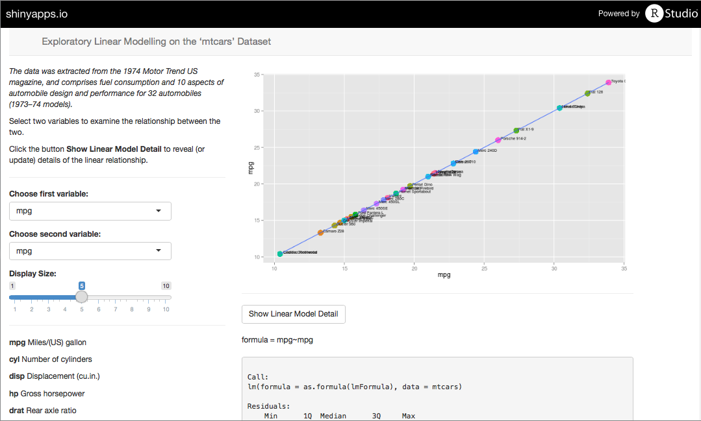
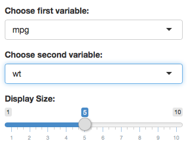
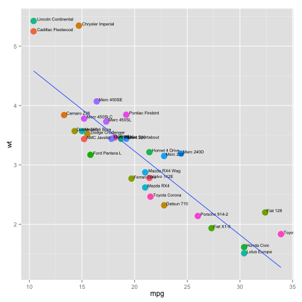
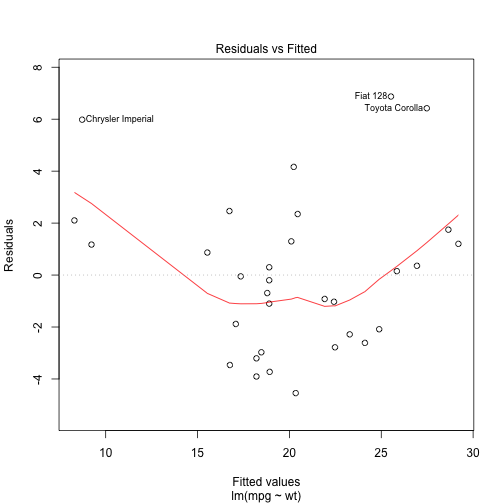

Developing Data Products
========================================================
css: custom.css
font-import: http://fonts.googleapis.com/css?family=Raleway
font-family: 'Raleway'

#### Shiny Application and Reproducible Pitch

## Exploratory Linear Modelling<br/>on the **mtcars** Dataset


Application Background
========================================================

This application examines the relationship between two variables from the ‘mtcars’ dataset:

*The data was extracted from the 1974 Motor Trend US magazine, and comprises fuel consumption and 10 aspects of automobile design and performance for 32 automobiles (1973–74 models).*

<div align="center">

</div>

The application is accessable at: (https://pogh.shinyapps.io/Assignment)

Selecting Variables
========================================================
On the left hand side you can set the two variables you would like to compare:

<div align="center">

</div>

You can also change the size of the points and text on the plot.

By changing any of the variables, the scatter plot will be updated automatically.

There’s also a list of the variables and their meanings under the variable selector.

Scatterplot Result
========================================================

This is what the scatter plot looks like.  The two variables are listed along the axes and a linear trend line is added to the plot.

 

Linear Modelling
========================================================


```r
lmModel <- lm(mpg~wt, mtcars)
summary(lmModel)
```

```

Call:
lm(formula = mpg ~ wt, data = mtcars)

Residuals:
    Min      1Q  Median      3Q     Max 
-4.5432 -2.3647 -0.1252  1.4096  6.8727 

Coefficients:
            Estimate Std. Error t value Pr(>|t|)    
(Intercept)  37.2851     1.8776  19.858  < 2e-16 ***
wt           -5.3445     0.5591  -9.559 1.29e-10 ***
---
Signif. codes:  0 '***' 0.001 '**' 0.01 '*' 0.05 '.' 0.1 ' ' 1

Residual standard error: 3.046 on 30 degrees of freedom
Multiple R-squared:  0.7528,	Adjusted R-squared:  0.7446 
F-statistic: 91.38 on 1 and 30 DF,  p-value: 1.294e-10
```
***
If you would like to see the details of the linear trend line, you can click the button **Show Linear Model Detail** to reveal (or update) details of the linear relationship.  It shows the detailed results and a residual plot.  
 

